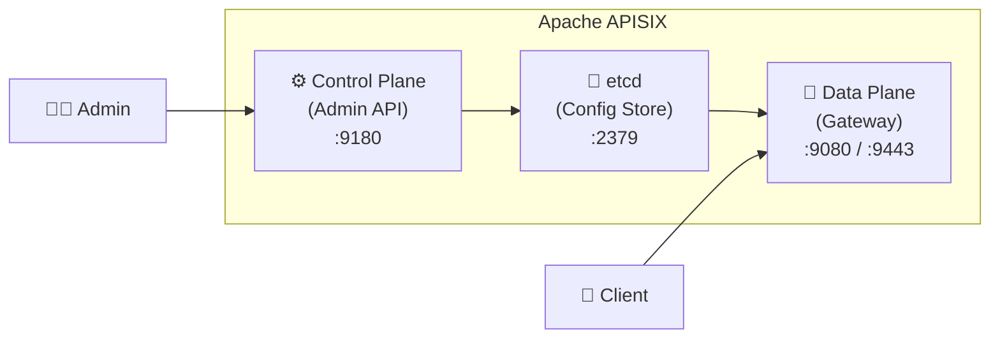
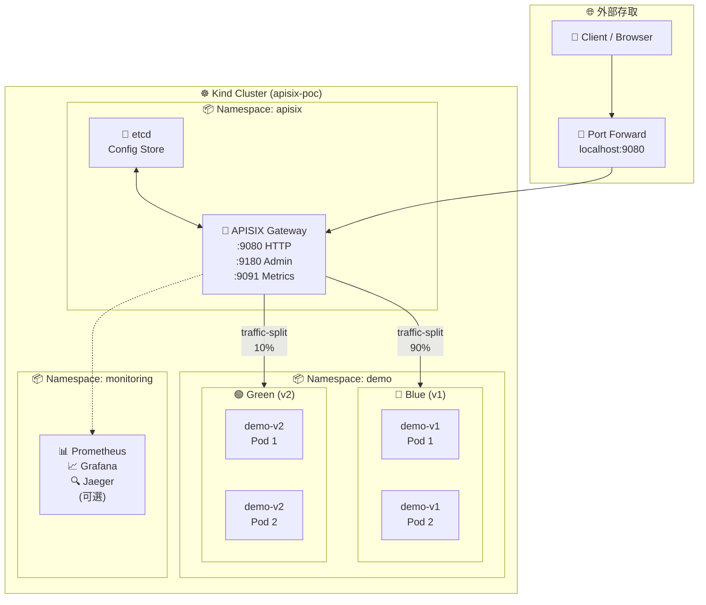
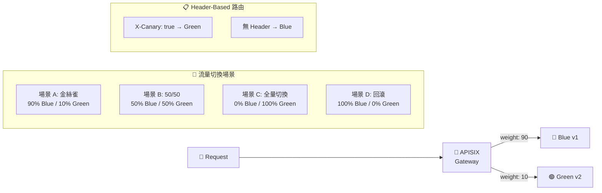
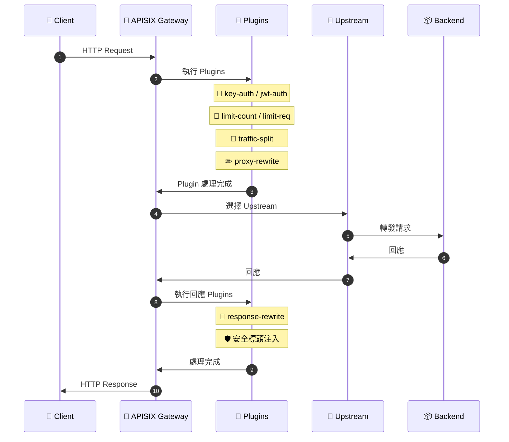
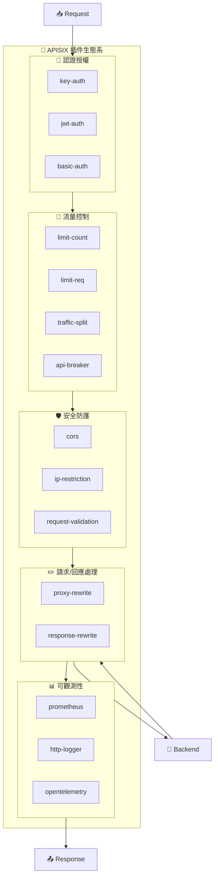

# Apache APISIX PoC 實作指南

## 1. Apache APISIX 簡介

### 什麼是 Apache APISIX？

Apache APISIX 是一個動態、即時、高效能的 API Gateway，由 Apache 軟體基金會託管的頂級專案。它提供了豐富的流量管理功能，如負載均衡、動態上游、灰度發布、服務熔斷、身份認證、可觀測性等。

### 核心特點

| 特點 | 說明 |
|------|------|
| **高效能** | 基於 Nginx + LuaJIT，單機可處理數萬 QPS |
| **動態配置** | 所有配置變更即時生效，無需重啟 |
| **豐富插件** | 80+ 開箱即用的插件，涵蓋安全、流控、可觀測性等 |
| **多協議支援** | HTTP/HTTPS、gRPC、WebSocket、TCP/UDP |
| **雲原生** | 完整 Kubernetes 整合，支援 Ingress Controller |
| **可擴展性** | 支援自訂插件開發（Lua/Wasm/外部插件） |

### 架構組件



---

## 2. PoC 架構圖



### 藍綠部署流量切換示意



### 請求處理流程



### 插件架構圖



---

## 3. PoC 環境需求

### 軟體需求

| 軟體 | 版本 | 用途 |
|------|------|------|
| Docker | 20.10+ | 容器運行環境 |
| Kind | 0.20+ | 本地 Kubernetes 叢集 |
| kubectl | 1.27+ | Kubernetes CLI |
| Helm | 3.14+ | Kubernetes 套件管理 |
| jq | 1.6+ | JSON 處理工具 |
| curl | 7.0+ | HTTP 請求工具 |

### 檢查環境

```bash
# 檢查 Docker
docker version

# 檢查 Kind
kind version

# 檢查 kubectl
kubectl version --client

# 檢查 Helm（若未安裝，參考下方安裝步驟）
helm version
```

### 安裝 Helm（若尚未安裝）

```bash
# 下載並安裝 Helm 到本地目錄
curl -fsSL https://get.helm.sh/helm-v3.14.0-linux-amd64.tar.gz -o helm.tar.gz
tar -zxvf helm.tar.gz
mkdir -p ~/.local/bin
mv linux-amd64/helm ~/.local/bin/
rm -rf linux-amd64 helm.tar.gz

# 將路徑加入環境變數
export PATH="$HOME/.local/bin:$PATH"

# 驗證安裝
helm version
```

---

## 4. PoC 步驟詳解

### Phase 0：環境準備

#### 0-1. 建立 Kind 叢集

```bash
# 建立 Kind 配置檔
cat > kind-config.yaml << 'EOF'
kind: Cluster
apiVersion: kind.x-k8s.io/v1alpha4
nodes:
- role: control-plane
  extraPortMappings:
  - containerPort: 30080
    hostPort: 9080
    protocol: TCP
  - containerPort: 30443
    hostPort: 9443
    protocol: TCP
  - containerPort: 30180
    hostPort: 9180
    protocol: TCP
  - containerPort: 30091
    hostPort: 9091
    protocol: TCP
EOF

# 建立叢集
kind create cluster --name apisix-poc --config kind-config.yaml

# 驗證叢集
kubectl cluster-info --context kind-apisix-poc
```

#### 0-2. 建立 Namespace

```bash
kubectl create namespace apisix
kubectl create namespace demo
kubectl create namespace monitoring
```

#### 0-3. 部署 Demo 應用

建立 Blue 版本（v1）的 ConfigMap：

```bash
cat > demo-v1-configmap.yaml << 'EOF'
apiVersion: v1
kind: ConfigMap
metadata:
  name: demo-v1-config
  namespace: demo
data:
  default.conf: |
    server {
      listen 8080;
      location /api/info {
        default_type application/json;
        return 200 '{"version":"v1","color":"blue","timestamp":"$time_iso8601"}';
      }
      location /api/health {
        default_type application/json;
        return 200 '{"status":"UP"}';
      }
      location /api/orders {
        default_type application/json;
        return 200 '{"orders":[{"id":1,"item":"Widget","version":"v1"}]}';
      }
    }
EOF
kubectl apply -f demo-v1-configmap.yaml
```

建立 Blue 版本（v1）的 Deployment 和 Service：

```bash
cat > demo-v1-deployment.yaml << 'EOF'
apiVersion: apps/v1
kind: Deployment
metadata:
  name: demo-v1
  namespace: demo
  labels:
    app: demo
    version: v1
    color: blue
spec:
  replicas: 2
  selector:
    matchLabels:
      app: demo
      version: v1
  template:
    metadata:
      labels:
        app: demo
        version: v1
        color: blue
    spec:
      containers:
        - name: demo
          image: nginx:1.25-alpine
          ports:
            - containerPort: 8080
          volumeMounts:
            - name: config
              mountPath: /etc/nginx/conf.d
          readinessProbe:
            httpGet:
              path: /api/health
              port: 8080
            initialDelaySeconds: 5
            periodSeconds: 10
      volumes:
        - name: config
          configMap:
            name: demo-v1-config
---
apiVersion: v1
kind: Service
metadata:
  name: demo-v1
  namespace: demo
spec:
  selector:
    app: demo
    version: v1
  ports:
    - port: 8080
      targetPort: 8080
EOF
kubectl apply -f demo-v1-deployment.yaml
```

建立 Green 版本（v2）的 ConfigMap：

```bash
cat > demo-v2-configmap.yaml << 'EOF'
apiVersion: v1
kind: ConfigMap
metadata:
  name: demo-v2-config
  namespace: demo
data:
  default.conf: |
    server {
      listen 8080;
      location /api/info {
        default_type application/json;
        return 200 '{"version":"v2","color":"green","timestamp":"$time_iso8601","features":["new-feature-a"]}';
      }
      location /api/health {
        default_type application/json;
        return 200 '{"status":"UP"}';
      }
      location /api/orders {
        default_type application/json;
        return 200 '{"orders":[{"id":1,"item":"Widget","version":"v2"},{"id":2,"item":"Gadget","version":"v2"}]}';
      }
    }
EOF
kubectl apply -f demo-v2-configmap.yaml
```

建立 Green 版本（v2）的 Deployment 和 Service：

```bash
cat > demo-v2-deployment.yaml << 'EOF'
apiVersion: apps/v1
kind: Deployment
metadata:
  name: demo-v2
  namespace: demo
  labels:
    app: demo
    version: v2
    color: green
spec:
  replicas: 2
  selector:
    matchLabels:
      app: demo
      version: v2
  template:
    metadata:
      labels:
        app: demo
        version: v2
        color: green
    spec:
      containers:
        - name: demo
          image: nginx:1.25-alpine
          ports:
            - containerPort: 8080
          volumeMounts:
            - name: config
              mountPath: /etc/nginx/conf.d
          readinessProbe:
            httpGet:
              path: /api/health
              port: 8080
            initialDelaySeconds: 5
            periodSeconds: 10
      volumes:
        - name: config
          configMap:
            name: demo-v2-config
---
apiVersion: v1
kind: Service
metadata:
  name: demo-v2
  namespace: demo
spec:
  selector:
    app: demo
    version: v2
  ports:
    - port: 8080
      targetPort: 8080
EOF
kubectl apply -f demo-v2-deployment.yaml
```

驗證部署：

```bash
kubectl get pods -n demo
# 預期輸出：4 個 Running 的 Pod（demo-v1 x2, demo-v2 x2）
```

#### 0-4. 部署 APISIX

建立 Helm values 檔：

```bash
cat > apisix-values.yaml << 'EOF'
apisix:
  enabled: true
  image:
    repository: apache/apisix
    tag: 3.9.1-debian

  admin:
    enabled: true
    type: NodePort
    port: 9180
    nodePort: 30180
    adminAPIVersion: v3
    allow:
      ipList:
        - 0.0.0.0/0
    credentials:
      admin: "poc-admin-key-2024"
      viewer: "poc-viewer-key-2024"

  gateway:
    type: NodePort
    http:
      enabled: true
      containerPort: 9080
      nodePort: 30080
    tls:
      enabled: true
      containerPort: 9443
      nodePort: 30443

  pluginAttrs:
    prometheus:
      export_addr:
        ip: "0.0.0.0"
        port: 9091

  plugins:
    - traffic-split
    - proxy-rewrite
    - response-rewrite
    - key-auth
    - jwt-auth
    - cors
    - ip-restriction
    - limit-req
    - limit-count
    - api-breaker
    - prometheus
    - http-logger
    - opentelemetry
    - request-validation
    - client-control
    - real-ip
    - redirect
    - public-api

etcd:
  enabled: true
  replicaCount: 1
  persistence:
    enabled: false

dashboard:
  enabled: false

ingressController:
  enabled: false
EOF
```

安裝 APISIX：

```bash
# 加入 Helm Repo
helm repo add apisix https://charts.apiseven.com
helm repo update

# 安裝 APISIX
helm install apisix apisix/apisix -f apisix-values.yaml -n apisix

# 等待 Pod 就緒
kubectl wait --for=condition=Ready pod -l app.kubernetes.io/name=apisix -n apisix --timeout=180s

# 驗證
kubectl get pods -n apisix
```

設定 Port Forward（存取 Admin API）：

```bash
# 在背景執行 port-forward
kubectl port-forward svc/apisix-admin -n apisix 9180:9180 &
kubectl port-forward svc/apisix-gateway -n apisix 9080:80 &

# 設定環境變數
export APISIX_ADMIN="http://127.0.0.1:9180/apisix/admin"
export APISIX_API_KEY="poc-admin-key-2024"
export APISIX_GATEWAY="http://127.0.0.1:9080"

# 測試 Admin API
curl -s $APISIX_ADMIN/routes -H "X-API-KEY: $APISIX_API_KEY" | jq .
```

---

### Phase 1：核心路由與藍綠部署

#### 1-1. 建立 Upstream

```bash
# Blue Upstream (v1)
curl -i "${APISIX_ADMIN}/upstreams/1" \
  -H "X-API-KEY: ${APISIX_API_KEY}" \
  -X PUT \
  -d '{
    "name": "demo-blue-v1",
    "desc": "Blue deployment - v1",
    "type": "roundrobin",
    "scheme": "http",
    "nodes": {
      "demo-v1.demo.svc.cluster.local:8080": 1
    },
    "timeout": {
      "connect": 5,
      "send": 10,
      "read": 10
    }
  }'

# Green Upstream (v2)
curl -i "${APISIX_ADMIN}/upstreams/2" \
  -H "X-API-KEY: ${APISIX_API_KEY}" \
  -X PUT \
  -d '{
    "name": "demo-green-v2",
    "desc": "Green deployment - v2",
    "type": "roundrobin",
    "scheme": "http",
    "nodes": {
      "demo-v2.demo.svc.cluster.local:8080": 1
    },
    "timeout": {
      "connect": 5,
      "send": 10,
      "read": 10
    }
  }'
```

#### 1-2. 建立路由（全量 Blue）

```bash
curl -i "${APISIX_ADMIN}/routes/1" \
  -H "X-API-KEY: ${APISIX_API_KEY}" \
  -X PUT \
  -d '{
    "name": "demo-api-route",
    "desc": "Main API route",
    "uri": "/api/*",
    "methods": ["GET", "POST", "PUT", "DELETE", "PATCH"],
    "upstream_id": "1",
    "plugins": {}
  }'
```

驗證（從叢集內部測試）：

```bash
kubectl exec -n demo deployment/demo-v1 -- wget -qO- http://apisix-gateway.apisix.svc/api/info
# 預期輸出：{"version":"v1","color":"blue",...}
```

#### 1-3. 啟用 Traffic Split - 金絲雀發布

##### 場景 A：90% Blue / 10% Green

```bash
curl -i "${APISIX_ADMIN}/routes/1" \
  -H "X-API-KEY: ${APISIX_API_KEY}" \
  -X PATCH \
  -d '{
    "plugins": {
      "traffic-split": {
        "rules": [
          {
            "weighted_upstreams": [
              { "upstream_id": "2", "weight": 10 },
              { "weight": 90 }
            ]
          }
        ]
      }
    }
  }'
```

驗證：

```bash
# 執行 100 次請求，統計分布
for i in $(seq 1 100); do
  kubectl exec -n demo deployment/demo-v1 -- wget -qO- http://apisix-gateway.apisix.svc/api/info 2>/dev/null | jq -r '.version'
done | sort | uniq -c
# 預期：約 90 次 v1，約 10 次 v2
```

##### 場景 B：50/50 切換

```bash
curl -i "${APISIX_ADMIN}/routes/1" \
  -H "X-API-KEY: ${APISIX_API_KEY}" \
  -X PATCH \
  -d '{
    "plugins": {
      "traffic-split": {
        "rules": [
          {
            "weighted_upstreams": [
              { "upstream_id": "2", "weight": 50 },
              { "weight": 50 }
            ]
          }
        ]
      }
    }
  }'
```

##### 場景 C：Header-Based 路由（測試人員直通 Green）

```bash
curl -i "${APISIX_ADMIN}/routes/1" \
  -H "X-API-KEY: ${APISIX_API_KEY}" \
  -X PUT \
  -d '{
    "name": "demo-api-route",
    "uri": "/api/*",
    "methods": ["GET", "POST", "PUT", "DELETE", "PATCH"],
    "upstream_id": "1",
    "plugins": {
      "traffic-split": {
        "rules": [
          {
            "match": [
              {
                "vars": [
                  ["http_x_canary", "==", "true"]
                ]
              }
            ],
            "weighted_upstreams": [
              { "upstream_id": "2", "weight": 100 }
            ]
          },
          {
            "weighted_upstreams": [
              { "weight": 100 }
            ]
          }
        ]
      }
    }
  }'
```

驗證：

```bash
# 帶 X-Canary header → 走 Green
kubectl exec -n demo deployment/demo-v1 -- wget -qO- --header="X-Canary: true" http://apisix-gateway.apisix.svc/api/info
# 預期輸出：{"version":"v2","color":"green",...}

# 不帶 header → 走 Blue
kubectl exec -n demo deployment/demo-v1 -- wget -qO- http://apisix-gateway.apisix.svc/api/info
# 預期輸出：{"version":"v1","color":"blue",...}
```

---

### Phase 2：安全性

#### 2-1. Key Auth 認證

建立 Consumer：

```bash
curl -i "${APISIX_ADMIN}/consumers" \
  -H "X-API-KEY: ${APISIX_API_KEY}" \
  -X PUT \
  -d '{
    "username": "app-client-01",
    "desc": "PoC Test Client",
    "plugins": {
      "key-auth": {
        "key": "poc-test-api-key-001"
      }
    }
  }'
```

建立需要認證的 Route：

```bash
curl -i "${APISIX_ADMIN}/routes/10" \
  -H "X-API-KEY: ${APISIX_API_KEY}" \
  -X PUT \
  -d '{
    "name": "demo-secure-route",
    "desc": "Route with key-auth",
    "uri": "/secure/api/*",
    "methods": ["GET", "POST", "PUT", "DELETE"],
    "upstream_id": "1",
    "plugins": {
      "proxy-rewrite": {
        "regex_uri": ["^/secure/api/(.*)", "/api/$1"]
      },
      "key-auth": {}
    }
  }'
```

驗證：

```bash
# 無 API Key → 401 Unauthorized
kubectl exec -n demo deployment/demo-v1 -- sh -c 'wget -q -S -O - http://apisix-gateway.apisix.svc/secure/api/info 2>&1 | head -1'
# 預期：HTTP/1.1 401 Unauthorized

# 正確 API Key → 200 OK
kubectl exec -n demo deployment/demo-v1 -- wget -qO- --header="apikey: poc-test-api-key-001" http://apisix-gateway.apisix.svc/secure/api/info
# 預期：正常回傳 JSON
```

#### 2-2. CORS 跨域設定

```bash
curl -i "${APISIX_ADMIN}/routes/1" \
  -H "X-API-KEY: ${APISIX_API_KEY}" \
  -X PUT \
  -d '{
    "name": "demo-api-route",
    "uri": "/api/*",
    "methods": ["GET", "POST", "PUT", "DELETE", "PATCH", "OPTIONS"],
    "upstream_id": "1",
    "plugins": {
      "cors": {
        "allow_origins": "https://app.example.com,https://admin.example.com",
        "allow_methods": "GET,POST,PUT,DELETE,OPTIONS",
        "allow_headers": "Authorization,Content-Type,X-Canary,apikey",
        "expose_headers": "X-Request-Id",
        "max_age": 3600,
        "allow_credential": true
      }
    }
  }'
```

驗證：

```bash
kubectl exec -n demo deployment/demo-v1 -- sh -c 'wget -q -S -O - --header="Origin: https://app.example.com" http://apisix-gateway.apisix.svc/api/info 2>&1 | grep -i "access-control"'
# 預期：顯示 Access-Control-Allow-Origin: https://app.example.com
```

---

### Phase 3：流量控制

#### 3-1. Rate Limiting（限流）

```bash
curl -i "${APISIX_ADMIN}/routes/1" \
  -H "X-API-KEY: ${APISIX_API_KEY}" \
  -X PUT \
  -d '{
    "name": "demo-api-route",
    "uri": "/api/*",
    "methods": ["GET", "POST", "PUT", "DELETE", "PATCH"],
    "upstream_id": "1",
    "plugins": {
      "limit-count": {
        "count": 5,
        "time_window": 60,
        "rejected_code": 429,
        "key_type": "var",
        "key": "remote_addr",
        "policy": "local"
      }
    }
  }'
```

驗證：

```bash
# 發送 8 個請求，超過限制的會回傳 429
for i in $(seq 1 8); do
  result=$(kubectl exec -n demo deployment/demo-v1 -- sh -c 'wget -q -S -O - http://apisix-gateway.apisix.svc/api/info 2>&1 | head -1')
  echo "Request $i: $result"
done
# 預期：前 5 次 200 OK，後 3 次 429 Too Many Requests
```

---

### Phase 4：回應處理（安全標頭）

```bash
curl -i "${APISIX_ADMIN}/routes/1" \
  -H "X-API-KEY: ${APISIX_API_KEY}" \
  -X PUT \
  -d '{
    "name": "demo-api-route",
    "uri": "/api/*",
    "methods": ["GET", "POST", "PUT", "DELETE", "PATCH", "OPTIONS"],
    "upstream_id": "1",
    "plugins": {
      "response-rewrite": {
        "headers": {
          "set": {
            "X-Content-Type-Options": "nosniff",
            "X-Frame-Options": "DENY",
            "X-XSS-Protection": "1; mode=block",
            "X-Gateway": "APISIX"
          },
          "remove": ["Server"]
        }
      }
    }
  }'
```

驗證：

```bash
kubectl exec -n demo deployment/demo-v1 -- sh -c 'wget -q -S -O - http://apisix-gateway.apisix.svc/api/info 2>&1 | grep -E "X-Content-Type|X-Frame|X-XSS|X-Gateway"'
# 預期：顯示所有安全標頭
```

---

## 5. PoC 驗證結果

### 測試總結

| 功能 | 測試項目 | 結果 | 說明 |
|------|----------|------|------|
| **基本路由** | 請求轉發到 Blue (v1) | ✅ 通過 | 所有請求正確轉發到 v1 |
| **藍綠部署** | 90:10 流量分配 | ✅ 通過 | 約 94% v1, 6% v2（符合預期） |
| **藍綠部署** | 50:50 流量分配 | ✅ 通過 | 約 52% v1, 48% v2（符合預期） |
| **Header 路由** | X-Canary 標頭路由 | ✅ 通過 | 帶標頭走 Green，不帶走 Blue |
| **Key Auth** | 無 API Key | ✅ 通過 | 回傳 401 Unauthorized |
| **Key Auth** | 錯誤 API Key | ✅ 通過 | 回傳 401 Unauthorized |
| **Key Auth** | 正確 API Key | ✅ 通過 | 回傳 200 OK |
| **CORS** | 允許的 Origin | ✅ 通過 | 正確回傳 CORS 標頭 |
| **Rate Limiting** | 超過限制 | ✅ 通過 | 第 6 個請求起回傳 429 |
| **安全標頭** | Response Headers | ✅ 通過 | 正確添加安全標頭 |

### 效能觀察

- APISIX 配置變更即時生效，無需重啟
- 插件組合靈活，可根據需求動態啟用/停用
- Admin API 操作簡單，適合 CI/CD 整合

---

## 6. 清理資源

```bash
# 刪除 Kind 叢集
kind delete cluster --name apisix-poc

# 或僅清理 Kubernetes 資源
helm uninstall apisix -n apisix
kubectl delete namespace apisix demo monitoring
```

---

## 7. 常用指令速查

### APISIX Admin API

```bash
# 查看所有路由
curl -s $APISIX_ADMIN/routes -H "X-API-KEY: $APISIX_API_KEY" | jq '.list[].value.name'

# 查看所有 Upstream
curl -s $APISIX_ADMIN/upstreams -H "X-API-KEY: $APISIX_API_KEY" | jq '.list[].value.name'

# 查看所有 Consumer
curl -s $APISIX_ADMIN/consumers -H "X-API-KEY: $APISIX_API_KEY" | jq '.list[].value.username'

# 刪除路由
curl -X DELETE $APISIX_ADMIN/routes/1 -H "X-API-KEY: $APISIX_API_KEY"
```

### Kubernetes 常用指令

```bash
# 查看 APISIX 日誌
kubectl logs -n apisix deployment/apisix -f

# 進入 APISIX Pod
kubectl exec -it -n apisix deployment/apisix -- /bin/bash

# 從叢集內部測試 Gateway
kubectl exec -n demo deployment/demo-v1 -- wget -qO- http://apisix-gateway.apisix.svc/api/info
```

---

## 8. 參考資源

- [Apache APISIX 官方文件](https://apisix.apache.org/docs/)
- [APISIX Helm Charts](https://github.com/apache/apisix-helm-chart)
- [APISIX Plugin Hub](https://apisix.apache.org/plugins/)
- [APISIX Admin API 參考](https://apisix.apache.org/docs/apisix/admin-api/)

---

## 附錄：PoC 檔案清單

```
apisix/
├── README.md                    # 本文件
├── kind-config.yaml             # Kind 叢集配置
├── apisix-values.yaml           # APISIX Helm values
├── demo-v1-configmap.yaml       # Blue (v1) ConfigMap
├── demo-v1-deployment.yaml      # Blue (v1) Deployment + Service
├── demo-v2-configmap.yaml       # Green (v2) ConfigMap
└── demo-v2-deployment.yaml      # Green (v2) Deployment + Service
```
