# Kubernetes Ingress vs. Apache APISIX API Gateway — PoC 實作指南

> **適合對象：** Kubernetes 網路與 API Gateway 的初學者
> **環境：** 本機 Kind（Kubernetes in Docker）叢集
> **目標：** 透過實際操作，比較 NGINX Ingress Controller 與 Apache APISIX 的功能差異

---

## 目錄

1. [核心概念說明](#1-核心概念說明)
   - [Service vs Ingress vs API Gateway 決策流程圖](#15-service-vs-ingress-vs-api-gateway--我該用哪個)
   - [深入理解 etcd 的角色](#16-深入理解-etcd-在-apisix-中的角色)
2. [架構總覽](#2-架構總覽)（含請求封包流向圖）
3. [前置準備](#3-前置準備)（含資源消耗對照表）
4. [快速開始](#4-快速開始)
5. [Phase 1：建立 Kind 叢集與部署範例應用](#5-phase-1建立-kind-叢集與部署範例應用)
6. [Phase 2：設定 NGINX Ingress Controller](#6-phase-2設定-nginx-ingress-controller)
7. [Phase 3：設定 Apache APISIX](#7-phase-3設定-apache-apisix)（含三種設定方式比較）
8. [Phase 4：比較測試](#8-phase-4比較測試)
9. [Phase 5：可觀測性（Observability）](#9-phase-5可觀測性observability)
10. [功能比較表](#10-功能比較表)
11. [結論與建議](#11-結論與建議)（含 Gateway API 未來趨勢）
12. [疑難排解](#12-疑難排解)（錯誤導向除錯指南）
13. [名詞解釋](#13-名詞解釋)

---

## 1. 核心概念說明

### 1.1 什麼是 Kubernetes Ingress？

**Kubernetes Ingress** 是 Kubernetes 原生的 API 物件，用來管理從叢集外部進入的 HTTP/HTTPS 流量。

你可以把它想像成**大樓的接待櫃台**——它查看進來的請求（URL 路徑或主機名稱），然後引導到正確的內部服務。

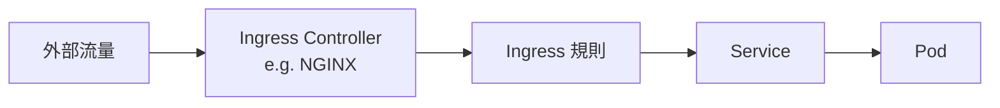

**重要概念：**

- **Ingress Resource**：一份 YAML 設定檔，定義路由規則（例如 `/api` 導向 `api-service`）
- **Ingress Controller**：實際執行路由的軟體。Kubernetes **預設不包含** Ingress Controller，你必須自行安裝（例如 NGINX Ingress Controller、Traefik）

**範例：**

```yaml
apiVersion: networking.k8s.io/v1
kind: Ingress
metadata:
  name: my-app-ingress
spec:
  rules:
    - host: myapp.local          # 當 Host 是 myapp.local 時
      http:
        paths:
          - path: /api            # 路徑 /api
            pathType: Prefix
            backend:
              service:
                name: api-service # 導向 api-service
                port:
                  number: 80
```

**優點：** 簡單、Kubernetes 原生、廣泛支援
**限制：** 僅限 L7 HTTP 路由、沒有內建限流、沒有認證插件

### 1.2 什麼是 API Gateway？

**API Gateway** 是位於客戶端與後端服務之間的一個更強大的層。除了路由之外，它還提供：

| 功能 | 說明 |
|---|---|
| **流量管理** | 限流（Rate Limiting）、熔斷（Circuit Breaking）、重試、超時 |
| **安全性** | 認證（JWT、OAuth2、mTLS）、IP 白名單、CORS |
| **可觀測性** | 指標（Metrics）、日誌、分散式追蹤（Tracing） |
| **轉換** | 請求/回應改寫、Header 操作 |
| **部署策略** | 金絲雀發布（Canary）、藍綠部署（Blue-Green） |

把它想像成同時具備**智慧保全 + 交通指揮 + 翻譯員**功能的角色。

### 1.3 什麼是 Apache APISIX？

**Apache APISIX** 是一個高效能、雲原生的 API Gateway，基於 **NGINX** 和 **Lua（OpenResty）** 建構，是 Apache 軟體基金會的頂級專案。

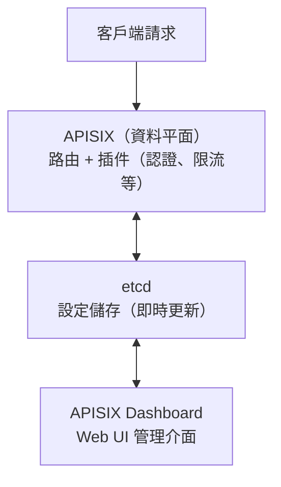

**主要特色：**

- **80+ 內建插件**（認證、流量控制、可觀測性、Serverless）
- **熱載入（Hot Reload）** — 修改路由和插件不需要重啟
- **多協定支援** — HTTP、gRPC、WebSocket、TCP/UDP
- **Kubernetes 原生** — 可透過 APISIX Ingress Controller CRD 作為 Ingress Controller

### 1.4 什麼是 Kind？

**Kind** 全名是「**K**ubernetes **in** **D**ocker」，它在你的本機 Docker 裡面運行完整的 Kubernetes 叢集，非常適合開發和 PoC。

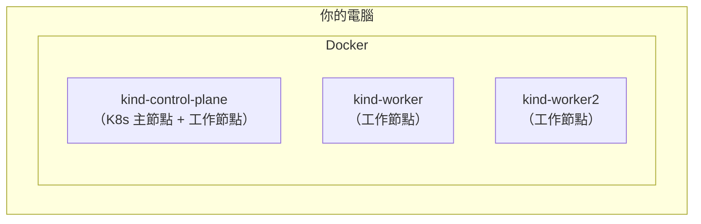

**為什麼用 Kind？**

- 不需要雲端費用
- 快速建立（不到 2 分鐘）
- 用完即棄 — 隨時刪除重建
- 支援 Port Mapping，可以從 localhost 存取服務

### 1.5 Service vs Ingress vs API Gateway — 我該用哪個？

初學者最常見的困惑是：Kubernetes 有這麼多種方式把流量送進來，到底該選哪個？

以下決策流程圖可以幫助你快速判斷：

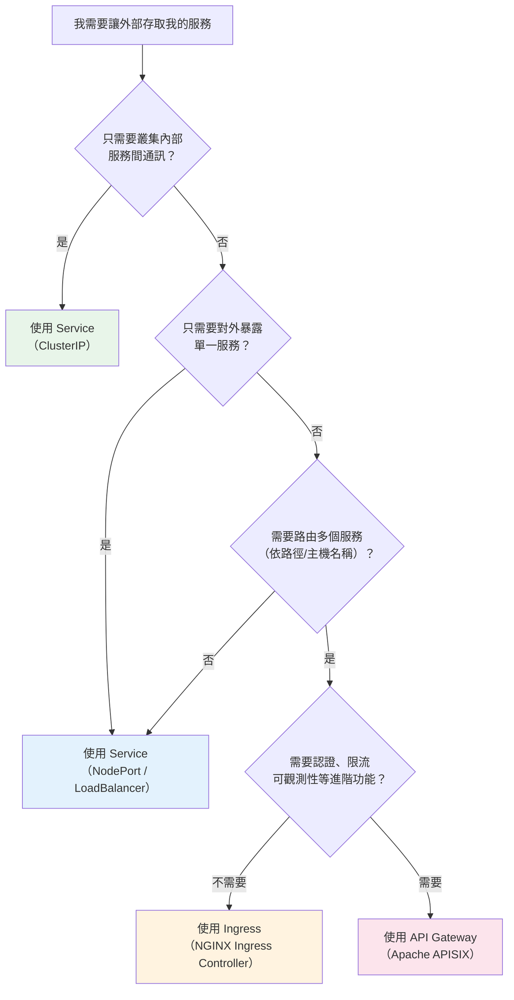

**各方式的簡單比較：**

| 方式 | 功能 | 適用場景 |
|---|---|---|
| **ClusterIP** | 叢集內部存取 | 微服務間互相呼叫 |
| **NodePort** | 透過節點 IP + Port 存取 | 開發測試、簡單對外暴露 |
| **LoadBalancer** | 雲端負載均衡器 | 生產環境單一服務對外 |
| **Ingress** | L7 路由（路徑/主機） | 多個服務共用一個入口 |
| **API Gateway** | 路由 + 認證 + 限流 + 監控 | 完整的 API 生命週期管理 |

### 1.6 深入理解 etcd 在 APISIX 中的角色

你可能會好奇：為什麼 APISIX 需要 etcd？NGINX Ingress 不需要額外的元件啊？

**簡單類比：**

- **NGINX Ingress** 像是用「紙本規則手冊」管理路由 — 改規則要重新印一本（reload config file）
- **APISIX** 像是用「即時同步的雲端文件」管理路由 — 改了馬上所有人都看到（etcd watch）

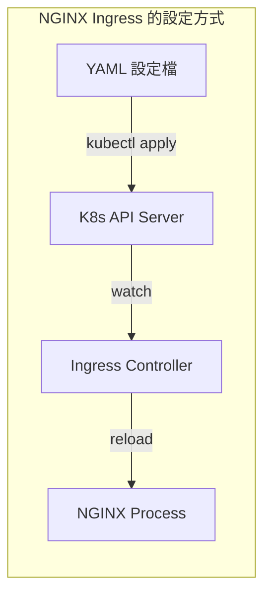

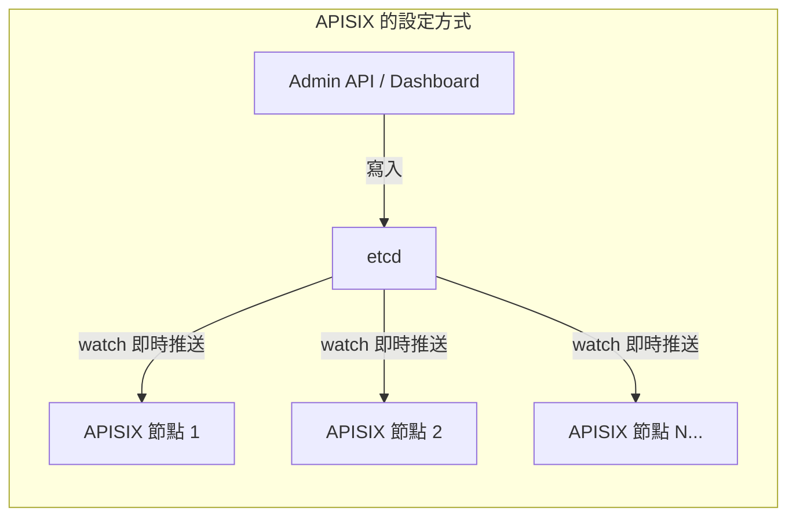

**etcd 的關鍵優勢：**

| 特性 | 說明 |
|---|---|
| **即時同步** | 設定變更在毫秒內推送到所有 APISIX 節點 |
| **無需重啟** | 不像 NGINX 需要 reload，APISIX 完全熱更新 |
| **多節點一致** | 多個 APISIX 實例自動保持設定一致 |
| **持久化** | 設定不會因為 APISIX 重啟而遺失 |

**在本 PoC 中如何查看 etcd 資料：**

```bash
# 進入 etcd Pod
kubectl -n apisix exec -it $(kubectl -n apisix get pods -l app.kubernetes.io/name=etcd -o name) -- sh

# 列出所有 APISIX 路由設定
etcdctl get /apisix/routes --prefix --keys-only
```

> **生產環境注意：** etcd 在生產環境建議部署 3 個節點以確保高可用性。本 PoC 為簡化只用 1 個節點。

---

## 2. 架構總覽

本 PoC 在同一個 Kind 叢集中同時部署 NGINX Ingress Controller 和 Apache APISIX，共用相同的後端服務：

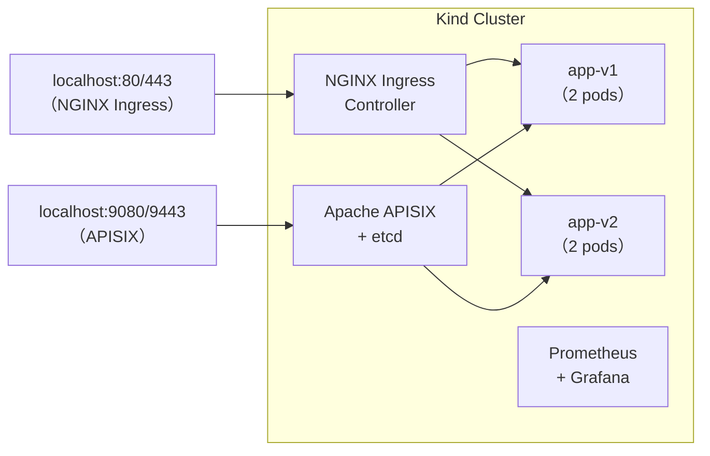

### 請求封包流向

了解一個 HTTP 請求如何從你的瀏覽器到達 Pod，是理解整個架構的關鍵。

**透過 NGINX Ingress 的請求流向：**

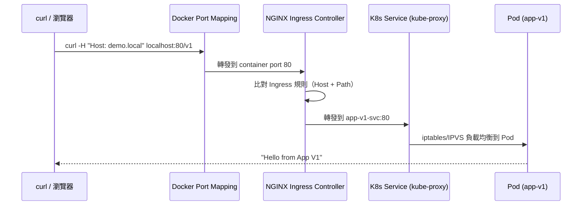

**透過 APISIX 的請求流向：**

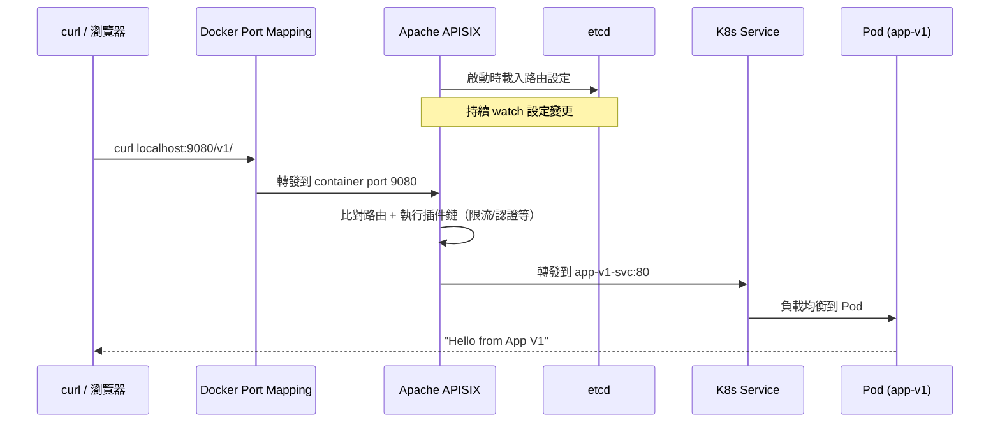

> **關鍵差異：** APISIX 在轉發前會執行「插件鏈」（Plugin Chain），這就是它能提供認證、限流等功能的原因。NGINX Ingress 只做簡單的路由比對。

**Port 對應表：**

| Port | 用途 |
|---|---|
| `80` / `443` | NGINX Ingress Controller（HTTP / HTTPS） |
| `9080` / `9443` | Apache APISIX（HTTP / HTTPS） |
| `30300` | Grafana Web UI |

---

## 3. 前置準備

### 3.1 必要工具

| 工具 | 最低版本 | 用途 | 安裝方式 |
|---|---|---|---|
| Docker | Latest | 容器執行環境 | [docker.com](https://docs.docker.com/get-docker/) |
| Kind | v0.20+ | 本地 K8s 叢集 | `go install sigs.k8s.io/kind@latest` |
| kubectl | v1.28+ | K8s CLI | [kubernetes.io](https://kubernetes.io/docs/tasks/tools/) |
| Helm | v3.12+ | K8s 套件管理 | [helm.sh](https://helm.sh/docs/intro/install/) |
| curl | Latest | HTTP 測試 | 系統內建 |

**選用工具（負載測試）：**

| 工具 | 用途 | 安裝方式 |
|---|---|---|
| hey | HTTP 負載測試 | `go install github.com/rakyll/hey@latest` |
| k6 | 進階負載測試 | [k6.io](https://k6.io/docs/get-started/installation/) |

### 3.2 硬體建議

- **CPU：** 4 核心以上
- **記憶體：** 最少 8 GB（建議 16 GB）
- **硬碟：** 20 GB 可用空間

**各元件的預估資源消耗：**

| 元件 | 記憶體 (RAM) | CPU | 說明 |
|---|---|---|---|
| Kind 叢集（3 節點） | ~1.5 GB | ~0.5 core | 基礎叢集開銷 |
| 範例應用（4 pods） | ~128 MB | ~0.2 core | 非常輕量 |
| + NGINX Ingress Controller | ~200 MB | ~0.2 core | 單一 Pod |
| + APISIX + etcd | ~500 MB | ~0.5 core | APISIX + etcd 各一個 Pod |
| + Prometheus + Grafana | ~800 MB | ~0.5 core | 選裝，佔用較多 |
| **全部安裝合計** | **~3.1 GB** | **~1.9 core** | |

> **低資源環境提示：** 如果你的記憶體只有 8 GB，可以：
> 1. 在 `kind-cluster.yaml` 中移除 worker 節點（只保留 control-plane）
> 2. 將範例應用的 `replicas` 從 2 改為 1
> 3. 不安裝 Prometheus + Grafana（跳過 Phase 5）

### 3.3 驗證安裝

```bash
docker version
kind version
kubectl version --client
helm version
```

---

## 4. 快速開始

如果你想一次跑完所有步驟：

```bash
# 1. 建立叢集
./scripts/01-create-cluster.sh

# 2. 部署範例應用
./scripts/02-deploy-apps.sh

# 3. 設定 NGINX Ingress
./scripts/03-setup-nginx-ingress.sh

# 4. 設定 APISIX
./scripts/04-setup-apisix.sh

# 5. 設定可觀測性（選用）
./scripts/05-setup-observability.sh

# 6. 執行測試
./scripts/06-run-tests.sh

# 清除環境
./scripts/cleanup.sh
```

以下章節會**逐步詳細說明**每個步驟。

---

## 5. Phase 1：建立 Kind 叢集與部署範例應用

### Step 1：建立 Kind 叢集

Kind 叢集設定檔 `kind-cluster.yaml` 定義了：
- 1 個 Control Plane 節點（帶有 `ingress-ready=true` 標籤和 Port Mapping）
- 2 個 Worker 節點

```bash
./scripts/01-create-cluster.sh
```

**背後做了什麼：**

```bash
# 建立叢集
kind create cluster --name poc-ingress-gw --config kind-cluster.yaml

# 驗證叢集
kubectl cluster-info --context kind-poc-ingress-gw
kubectl get nodes
```

**預期輸出：**

```
NAME                            STATUS   ROLES           AGE   VERSION
poc-ingress-gw-control-plane    Ready    control-plane   30s   v1.31.0
poc-ingress-gw-worker           Ready    <none>          20s   v1.31.0
poc-ingress-gw-worker2          Ready    <none>          20s   v1.31.0
```

### Step 2：部署範例應用

我們部署兩個簡單的 HTTP 服務作為路由目標：

- **app-v1**：回應 `Hello from App V1`
- **app-v2**：回應 `Hello from App V2`

```bash
./scripts/02-deploy-apps.sh
```

**背後做了什麼：**

```bash
kubectl apply -f apps/sample-apps.yaml
kubectl wait --for=condition=ready pod --selector=app=demo --timeout=120s
```

**驗證：**

```bash
# 查看部署狀態
kubectl get pods -l app=demo

# 預期看到 4 個 Pod（app-v1 x2, app-v2 x2）
NAME                      READY   STATUS    RESTARTS   AGE
app-v1-xxxxx-yyyyy        1/1     Running   0          30s
app-v1-xxxxx-zzzzz        1/1     Running   0          30s
app-v2-xxxxx-aaaaa        1/1     Running   0          30s
app-v2-xxxxx-bbbbb        1/1     Running   0          30s
```

---

## 6. Phase 2：設定 NGINX Ingress Controller

### Step 1：安裝 NGINX Ingress Controller

```bash
./scripts/03-setup-nginx-ingress.sh
```

**背後做了什麼：**

```bash
# 安裝 NGINX Ingress Controller（Kind 專用版本）
kubectl apply -f https://raw.githubusercontent.com/kubernetes/ingress-nginx/main/deploy/static/provider/kind/deploy.yaml

# 等待 Controller 就緒
kubectl wait --namespace ingress-nginx \
  --for=condition=ready pod \
  --selector=app.kubernetes.io/component=controller \
  --timeout=120s
```

### Step 2：設定路由規則

腳本會自動套用兩個 Ingress 資源：

**基本路由 (`nginx-ingress/nginx-ingress.yaml`)：**

| 請求 | 導向 |
|---|---|
| `Host: demo.local` + `/v1` | app-v1-svc |
| `Host: demo.local` + `/v2` | app-v2-svc |

**限流路由 (`nginx-ingress/nginx-ingress-ratelimit.yaml`)：**

| 請求 | 導向 | 限制 |
|---|---|---|
| `Host: demo-limited.local` + `/` | app-v1-svc | 10 req/s，burst x5 |

### Step 3：測試

```bash
# 基本路由測試
curl -H "Host: demo.local" http://localhost/v1
# 預期輸出：Hello from App V1

curl -H "Host: demo.local" http://localhost/v2
# 預期輸出：Hello from App V2

# 限流測試（快速發送 20 個請求）
for i in $(seq 1 20); do
  curl -s -o /dev/null -w "%{http_code}\n" -H "Host: demo-limited.local" http://localhost/
done
# 預期：前幾個回 200，後面開始回 503
```

> **為什麼要加 `-H "Host: demo.local"`？**
> 因為 NGINX Ingress 使用 Host-based routing，需要指定 Host header 來匹配 Ingress 規則。在本機測試時，我們用 curl 的 `-H` 參數模擬 DNS 解析。

---

## 7. Phase 3：設定 Apache APISIX

### Step 1：安裝 APISIX

```bash
./scripts/04-setup-apisix.sh
```

**背後做了什麼：**

```bash
# 新增 Helm repo
helm repo add apisix https://charts.apiseven.com
helm repo update

# 透過 Helm 安裝 APISIX（使用自訂 values）
helm install apisix apisix/apisix \
  --namespace apisix \
  --create-namespace \
  -f apisix/apisix-values.yaml
```

### Step 2：設定路由與插件

腳本會透過 APISIX Admin API 設定以下路由：

| 路由 | 路徑 | 目標 | 功能 |
|---|---|---|---|
| Route 1 | `/v1/*` | app-v1-svc | 基本路由 |
| Route 2 | `/v2/*` | app-v2-svc | 基本路由 |
| Route 3 | `/v1-limited/*` | app-v1-svc | 限流（10 req/s） |
| Route 4 | `/v1-auth/*` | app-v1-svc | API Key 認證 |
| Route 5 | `/canary/*` | 80% v1 / 20% v2 | 金絲雀發布 |

### Step 3：測試

```bash
# 基本路由
curl http://localhost:9080/v1/
# 預期：Hello from App V1

curl http://localhost:9080/v2/
# 預期：Hello from App V2

# API Key 認證 — 不帶 key（應該被拒絕）
curl -i http://localhost:9080/v1-auth/
# 預期：HTTP 401 Unauthorized

# API Key 認證 — 帶 key
curl http://localhost:9080/v1-auth/ -H "apikey: my-secret-api-key-123"
# 預期：Hello from App V1

# 金絲雀測試（100 次請求，觀察分佈）
for i in $(seq 1 100); do
  curl -s http://localhost:9080/canary/
done | sort | uniq -c
# 預期：約 80 次 "Hello from App V1"，20 次 "Hello from App V2"
```

> **APISIX vs NGINX Ingress 的設定方式差異：**
>
> | | NGINX Ingress | APISIX |
> |---|---|---|
> | 設定方式 | YAML + Annotations | Admin API（HTTP REST） |
> | 生效時間 | 需要 reload | 即時生效（透過 etcd） |
> | 彈性 | 受限於 Annotation | 80+ 插件自由組合 |

### APISIX 的三種設定方式

APISIX 提供三種設定方式，適合不同的使用場景：

| 方式 | 適用場景 | 說明 |
|---|---|---|
| **Admin API** | 腳本化、自動化 | 透過 HTTP REST API 直接操作，本 PoC 主要使用此方式 |
| **Dashboard** | 視覺化探索、初學者 | Web UI 介面，適合用滑鼠點選設定路由和插件 |
| **APISIX Ingress Controller (CRD)** | GitOps、宣告式管理 | 用 Kubernetes YAML 定義路由，適合版本控制 |

**同一條路由的三種寫法比較：**

**方式 1 — Admin API（本 PoC 使用）：**

```bash
curl http://127.0.0.1:9180/apisix/admin/routes/1 \
  -H "X-API-KEY: edd1c9f034335f136f87ad84b625c8f1" \
  -X PUT -d '{
    "uri": "/v1/*",
    "upstream": {
      "type": "roundrobin",
      "nodes": { "app-v1-svc.default.svc.cluster.local:80": 1 }
    }
  }'
```

**方式 2 — Dashboard：**

在 `http://localhost:9000` 的 Web UI 中，點選「Routes」→「Create」→ 填寫 URI 和 Upstream。

**方式 3 — CRD（YAML 宣告式）：**

```yaml
apiVersion: apisix.apache.org/v2
kind: ApisixRoute
metadata:
  name: route-v1
spec:
  http:
    - name: route-v1
      match:
        paths:
          - /v1/*
      backends:
        - serviceName: app-v1-svc
          servicePort: 80
```

> **建議：** 初學者先用 Admin API 理解概念，熟悉後轉向 CRD 方式以配合 GitOps 流程。

---

## 8. Phase 4：比較測試

執行自動化測試腳本，涵蓋 10 個測試案例：

```bash
./scripts/06-run-tests.sh
```

### 測試案例清單

| 編號 | 測試項目 | NGINX Ingress | APISIX | 測試工具 |
|---|---|---|---|---|
| TC-01 | 路徑路由（Path-based） | ✅ Ingress YAML | ✅ Admin API | curl |
| TC-02 | 主機路由（Host-based） | ✅ Ingress YAML | ✅ Admin API | curl |
| TC-03 | 限流（Rate Limiting） | ⚠️ Annotation（有限） | ✅ Plugin（靈活） | curl loop |
| TC-04 | API Key 認證 | ❌ 無內建 | ✅ key-auth 插件 | curl |
| TC-05 | JWT 認證 | ❌ 無內建 | ✅ jwt-auth 插件 | curl |
| TC-06 | 金絲雀發布（加權） | ⚠️ 有限支援 | ✅ 加權 Upstream | curl loop |
| TC-07 | 請求轉換 | ⚠️ Annotation | ✅ proxy-rewrite | curl |
| TC-08 | Prometheus 指標 | ✅ 內建 | ✅ prometheus 插件 | curl |
| TC-09 | 存取日誌 | ✅ NGINX logs | ✅ http-logger | kubectl logs |
| TC-10 | 熱更新設定 | ❌ 需 reload | ✅ 即時（etcd） | curl |

### 負載測試（選用）

如果安裝了 `hey` 工具，可以做更精確的負載測試：

```bash
# NGINX Ingress 限流測試
hey -n 200 -c 20 -H "Host: demo-limited.local" http://localhost:80/

# APISIX 限流測試
hey -n 200 -c 20 http://localhost:9080/v1-limited/
```

---

## 9. Phase 5：可觀測性（Observability）

### 安裝 Prometheus + Grafana

```bash
./scripts/05-setup-observability.sh
```

### 存取 Grafana

- **URL：** `http://localhost:30300`
- **帳號：** `admin`
- **密碼：** `admin`

### APISIX Prometheus 指標

APISIX 啟用 Prometheus 插件後，可以在以下端點查看指標：

```bash
# 透過 port-forward 存取 APISIX 的 Prometheus 指標
kubectl -n apisix port-forward svc/apisix-gateway 9080:9080 &
curl http://localhost:9080/apisix/prometheus/metrics
```

常見指標：

| 指標名稱 | 說明 |
|---|---|
| `apisix_http_status` | HTTP 狀態碼分佈 |
| `apisix_bandwidth` | 流量頻寬 |
| `apisix_upstream_latency` | 上游服務延遲 |
| `apisix_http_latency` | HTTP 請求延遲 |

---

## 10. 功能比較表

| 比較項目 | 權重 | NGINX Ingress | Apache APISIX | 說明 |
|---|---|---|---|---|
| **安裝容易度** | 15% | ⭐⭐⭐⭐⭐ | ⭐⭐⭐ | NGINX 一行指令；APISIX 需要 Helm + etcd |
| **路由彈性** | 15% | ⭐⭐⭐ | ⭐⭐⭐⭐⭐ | APISIX 支援更多路由條件 |
| **流量管理** | 20% | ⭐⭐ | ⭐⭐⭐⭐⭐ | APISIX 有限流、熔斷、重試等插件 |
| **安全功能** | 20% | ⭐⭐ | ⭐⭐⭐⭐⭐ | APISIX 內建 JWT、Key-Auth、OAuth2 等 |
| **可觀測性** | 15% | ⭐⭐⭐ | ⭐⭐⭐⭐⭐ | APISIX 有更豐富的 Prometheus 指標 |
| **金絲雀/藍綠** | 10% | ⭐⭐ | ⭐⭐⭐⭐⭐ | APISIX 原生支援加權流量分配 |
| **維運負擔** | 5% | ⭐⭐⭐⭐⭐ | ⭐⭐⭐ | APISIX 多了 etcd 元件需要維護 |
| **加權總分** | 100% | **2.8/5** | **4.7/5** | |

---

## 11. 結論與建議

### 選擇 NGINX Ingress 的時機

- 需求僅限**簡單的 L7 HTTP 路由**（路徑、主機名稱）
- 團隊已熟悉 NGINX 設定
- 希望**最小化維運負擔**（不需要額外的 etcd）
- 中小型部署，不需要複雜的 API 管理

### 選擇 Apache APISIX 的時機

- 需要完整的 **API Gateway 功能**（認證、限流、熔斷）
- 微服務架構，需要精細的**流量控制**
- 需要**金絲雀發布**或**藍綠部署**
- 需要豐富的**可觀測性**（指標、日誌、追蹤）
- 金融、零售、製造業等需要 API 治理的場景

### 混合方案（推薦）

在許多企業場景中，可以同時使用兩者：

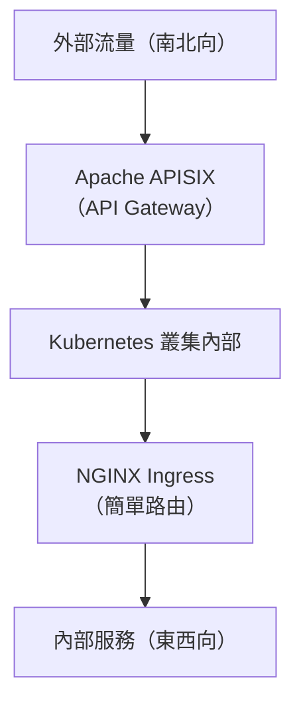

- **APISIX** 負責對外的 API 管理（認證、限流、監控）
- **NGINX Ingress** 負責叢集內部服務之間的簡單路由

### 展望：Gateway API — 下一代標準

> **注意：** 本節是補充知識，不影響 PoC 操作。

Kubernetes 社群正在推動 **Gateway API** 作為 Ingress 的下一代替代方案。如果你打算長期投入 Kubernetes 網路領域，值得關注：

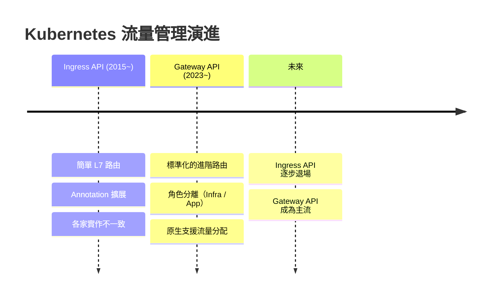

| 比較 | Ingress API | Gateway API |
|---|---|---|
| **狀態** | 穩定但功能凍結 | 核心功能 GA，持續演進 |
| **路由能力** | 僅 Host + Path | Host、Path、Header、Method、Query |
| **流量分配** | 需要 Annotation | 原生 `backendRefs` 加權 |
| **角色分離** | 無 | 基礎設施管理員 vs 應用開發者 |
| **APISIX 支援** | ✅ | ✅ 透過 APISIX Ingress Controller |

**對本 PoC 的影響：** 無。本 PoC 的核心比較（Ingress vs API Gateway）仍然有效。Gateway API 解決的是「標準化路由規格」的問題，而 APISIX 作為 API Gateway 提供的認證、限流、可觀測性等功能，是 Gateway API 不涵蓋的範疇。

---

## 12. 疑難排解

### 錯誤導向除錯指南

遇到問題時，先確認你看到的是什麼錯誤，然後按照對應的排查流程處理：

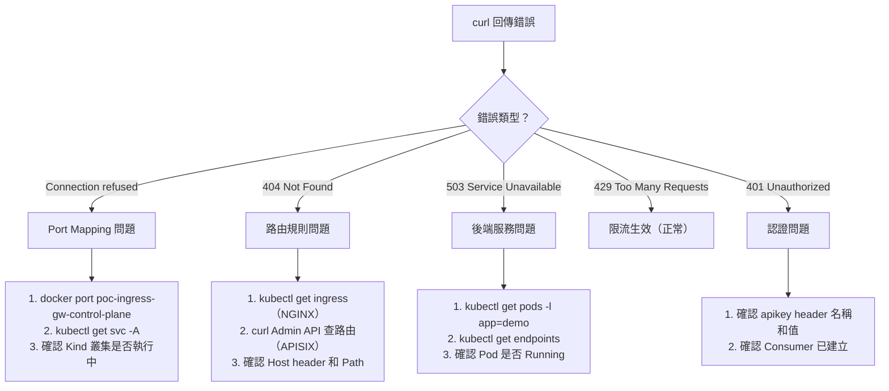

### Connection refused — 連線被拒絕

**症狀：** `curl: (7) Failed to connect to localhost port 80: Connection refused`

**排查步驟：**

```bash
# Step 1: 確認 Docker 正在執行
docker ps

# Step 2: 確認 Kind 叢集存在
kind get clusters

# Step 3: 確認 Port Mapping
docker port poc-ingress-gw-control-plane
# 預期看到：80/tcp -> 0.0.0.0:80

# Step 4: 確認 Ingress Controller Pod 正在執行
kubectl -n ingress-nginx get pods
# 如果 Pod 不是 Running，查看日誌：
kubectl -n ingress-nginx logs -l app.kubernetes.io/component=controller

# 解決方案：如果叢集不存在，重新建立
kind delete cluster --name poc-ingress-gw
./scripts/01-create-cluster.sh
```

### 404 Not Found — 找不到路由

**症狀：** 收到 404 回應

**排查步驟：**

```bash
# NGINX Ingress 排查：
# Step 1: 確認 Ingress 資源存在
kubectl get ingress

# Step 2: 確認 Host header 正確（常見錯誤！）
# 錯誤示範 — 少了 Host header：
curl http://localhost/v1
# 正確示範：
curl -H "Host: demo.local" http://localhost/v1

# Step 3: 確認 Ingress 規則的 path 和 service 名稱
kubectl describe ingress demo-ingress

# APISIX 排查：
# Step 1: 確認路由已建立
kubectl -n apisix port-forward svc/apisix-admin 9180:9180 &
curl http://127.0.0.1:9180/apisix/admin/routes \
  -H "X-API-KEY: edd1c9f034335f136f87ad84b625c8f1"

# Step 2: 注意 URI 結尾的斜線
# APISIX 路由定義為 /v1/*，所以：
curl http://localhost:9080/v1/    # 正確（有尾斜線）
curl http://localhost:9080/v1     # 可能 404（沒有尾斜線）
```

### 503 Service Unavailable — 後端服務不可用

**症狀：** 收到 503 回應

**排查步驟：**

```bash
# Step 1: 確認 Pod 正在執行
kubectl get pods -l app=demo
# 所有 Pod 應該是 Running 狀態

# Step 2: 確認 Service 有對應的 Endpoints
kubectl get endpoints app-v1-svc app-v2-svc
# 應該看到 IP 位址，不是 <none>

# Step 3: 從叢集內部測試直連
kubectl run tmp --image=curlimages/curl --restart=Never --rm -it -- \
  curl http://app-v1-svc.default.svc.cluster.local
# 如果成功，問題在 Ingress/APISIX 設定；如果失敗，問題在 Service/Pod
```

### APISIX 相關問題

```bash
# APISIX Pod 無法啟動
kubectl -n apisix get pods
kubectl -n apisix logs -l app.kubernetes.io/name=apisix
kubectl -n apisix logs -l app.kubernetes.io/name=etcd

# Admin API 無法存取
kubectl -n apisix port-forward svc/apisix-admin 9180:9180
curl http://127.0.0.1:9180/apisix/admin/routes \
  -H "X-API-KEY: edd1c9f034335f136f87ad84b625c8f1"
```

### 資源不足

```bash
# 查看節點資源使用狀況
kubectl top nodes

# 查看 Pod 資源使用
kubectl top pods -A

# 如果記憶體不足，可以減少 Worker 節點
# 修改 kind-cluster.yaml，移除 worker 節點後重建
```

> **除錯黃金法則：** 從外到內逐層排查 — Port Mapping → Ingress/APISIX → Service → Pod。每一層都先確認它「收到了請求」再往下查。

---

## 13. 名詞解釋

| 名詞 | 說明 |
|---|---|
| **L7 路由** | 基於 HTTP 屬性（路徑、主機、Header）做路由決策，對應 OSI 模型第 7 層 |
| **Ingress Controller** | 實作 Kubernetes Ingress 規格的軟體 |
| **CRD** | Custom Resource Definition，擴展 Kubernetes API 的自訂資源類型 |
| **etcd** | 分散式鍵值儲存庫，APISIX 用它來儲存設定 |
| **南北向流量** | 進出叢集的流量（外部客戶端到內部服務） |
| **東西向流量** | 叢集內部服務之間的流量 |
| **金絲雀發布** | 逐步將流量從舊版本轉移到新版本的部署策略 |
| **熔斷器** | 當下游服務故障時，停止發送請求讓它恢復的模式 |
| **mTLS** | 雙向 TLS，客戶端和伺服器彼此用憑證驗證身份 |
| **限流** | 限制單位時間內的請求數量，防止服務過載 |
| **Hot Reload** | 不重啟服務即可更新設定的能力 |
| **Upstream** | APISIX 中代表後端服務的概念，定義了目標節點和負載均衡策略 |
| **Plugin** | APISIX 中的插件，提供各種功能（認證、限流、日誌等） |
| **Consumer** | APISIX 中代表 API 使用者的概念，可綁定認證憑證 |

---

## 專案結構

```
ingress-apigw-poc/
├── README.md                          # 本文件（zh-TW 說明指南）
├── poc-k8s-ingress-vs-apisix.md       # PoC 計畫書（原始英文版）
├── kind-cluster.yaml                  # Kind 叢集設定檔
├── apps/
│   └── sample-apps.yaml               # 範例應用（app-v1, app-v2）
├── nginx-ingress/
│   ├── nginx-ingress.yaml             # NGINX 基本路由
│   └── nginx-ingress-ratelimit.yaml   # NGINX 限流設定
├── apisix/
│   ├── apisix-values.yaml             # APISIX Helm 安裝參數
│   └── apisix-routes.sh               # APISIX 路由與插件設定腳本
├── observability/
│   └── prometheus-values.yaml         # Prometheus + Grafana 安裝參數
└── scripts/
    ├── 01-create-cluster.sh           # 建立 Kind 叢集
    ├── 02-deploy-apps.sh              # 部署範例應用
    ├── 03-setup-nginx-ingress.sh      # 設定 NGINX Ingress
    ├── 04-setup-apisix.sh             # 設定 Apache APISIX
    ├── 05-setup-observability.sh      # 設定可觀測性
    ├── 06-run-tests.sh                # 執行比較測試
    └── cleanup.sh                     # 清除環境
```

---

*本文件依據 [poc-k8s-ingress-vs-apisix.md](poc-k8s-ingress-vs-apisix.md) PoC 計畫書撰寫*
